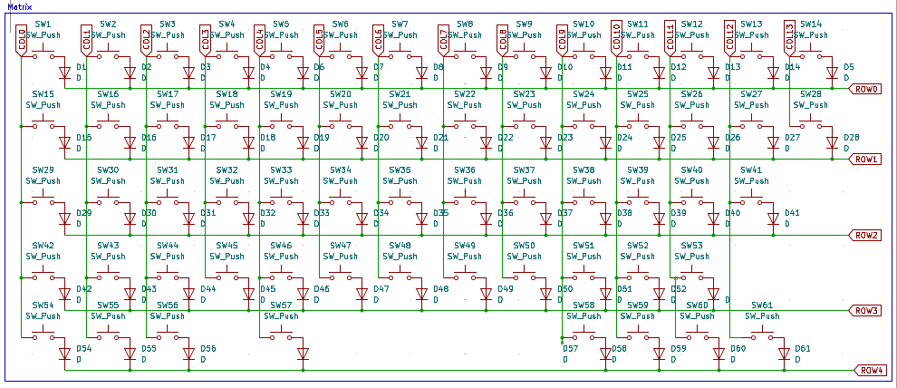
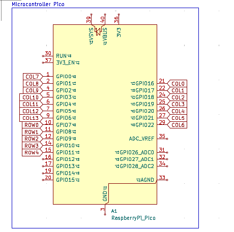
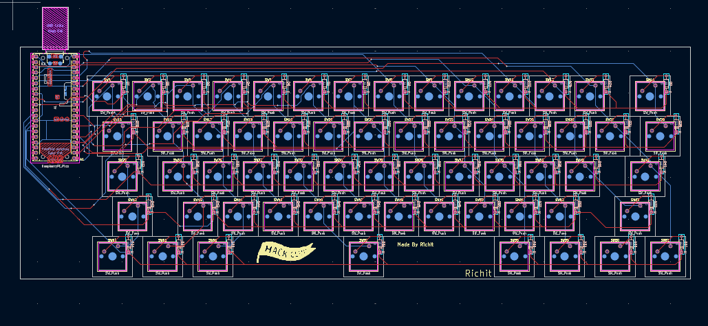
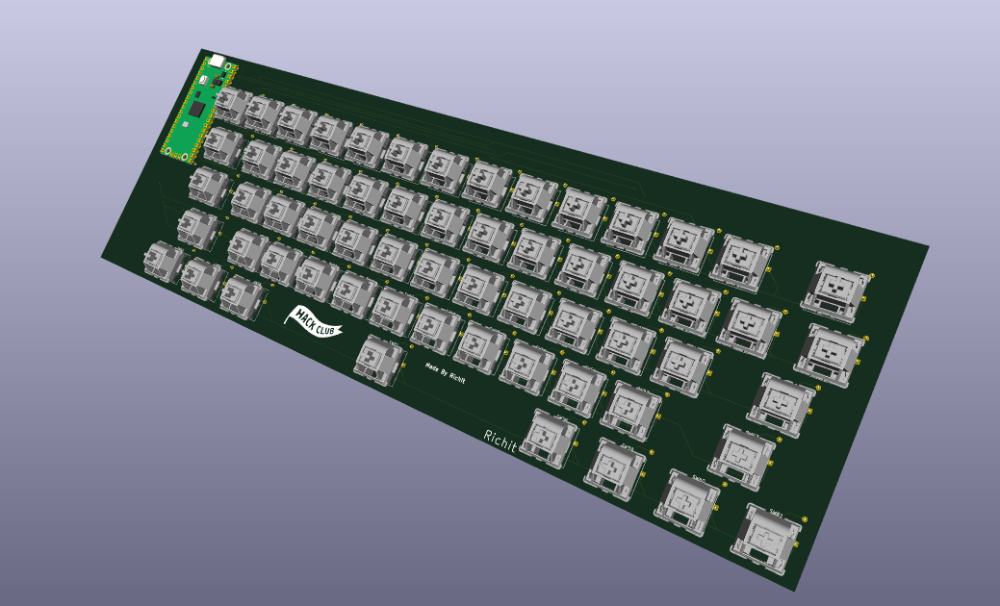
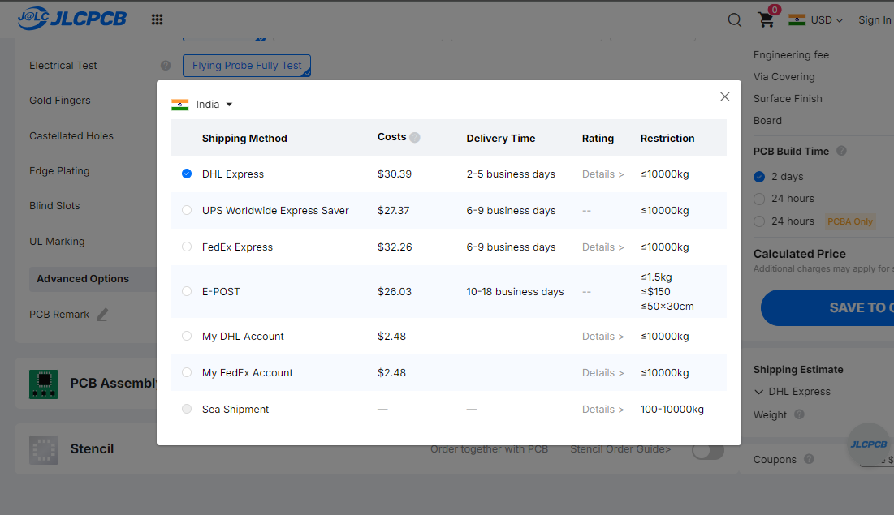
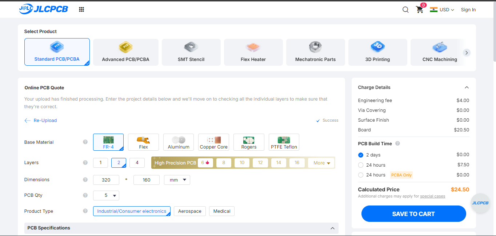
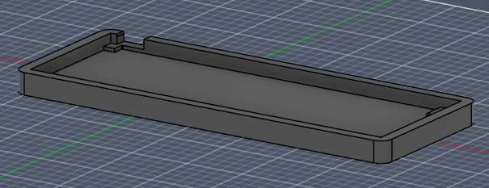
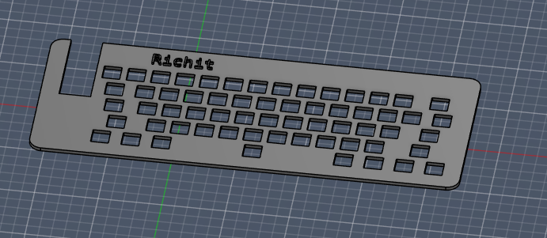
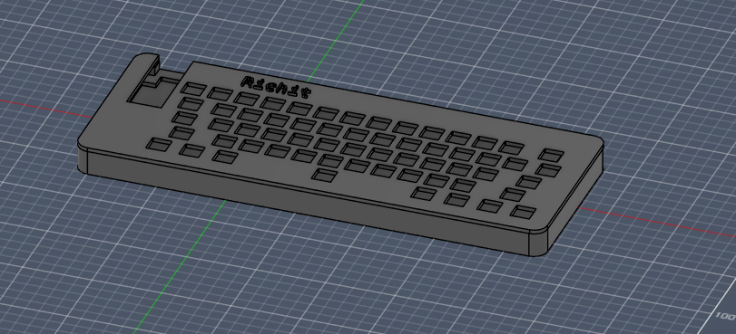
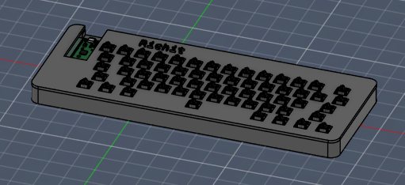

# keyboard
my own very little keyboard!

i think i need a new keyboard, so whynot make a new one. hehehe

Well, its my first ever keyboard after i made my micropad. (Using qmk for first time aswell)
## Features
- 60% keyboard - 60 keys
- made using qmk
- uses pi pico
- simple matrix design
- easy to recreate

## Schematics
Matrix: <br>
 <br>
Microcontroller: <br>
 <br>

## PCB Design


### PCB Checkout
<br>
<br>


```
Q: Why did i use Robu instead of JLCPCB or SEEED STUDIO FUSION?
A: I live in India and, Robu might be expensive at first but actually it is alot cheaper! Shipping costs to me from JLCPCB and SEEEDSTUDIO FUSION are around $15-$30. Whereas at a little expensive cost, i can get from Robu which is India based and avoid customs as well!

Also my home is like in a region where its harder to ship stuff so maybe robu might also charge extra
```

## CAD 
Case with PCB: <br>
 <br>
 <br>
 <br>
 <br>

## Firmware
I made the firmware using QMK. And compiled it in `firmware` directory


